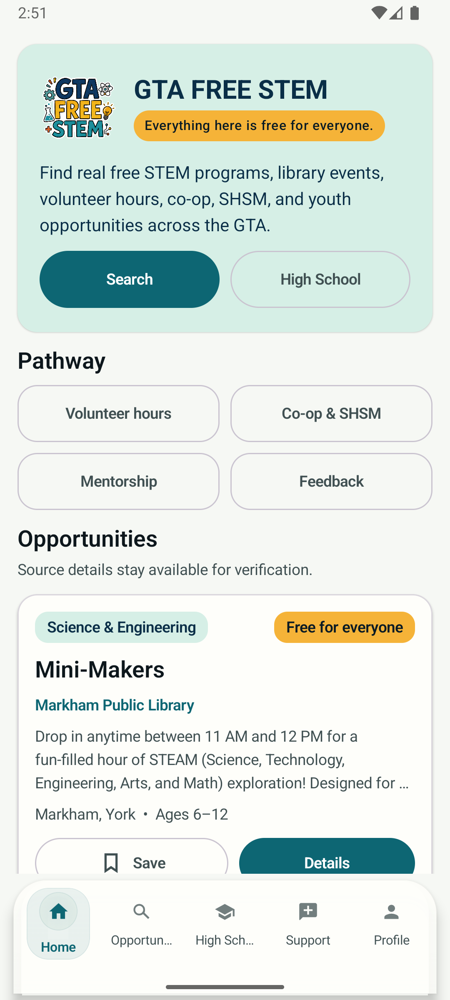
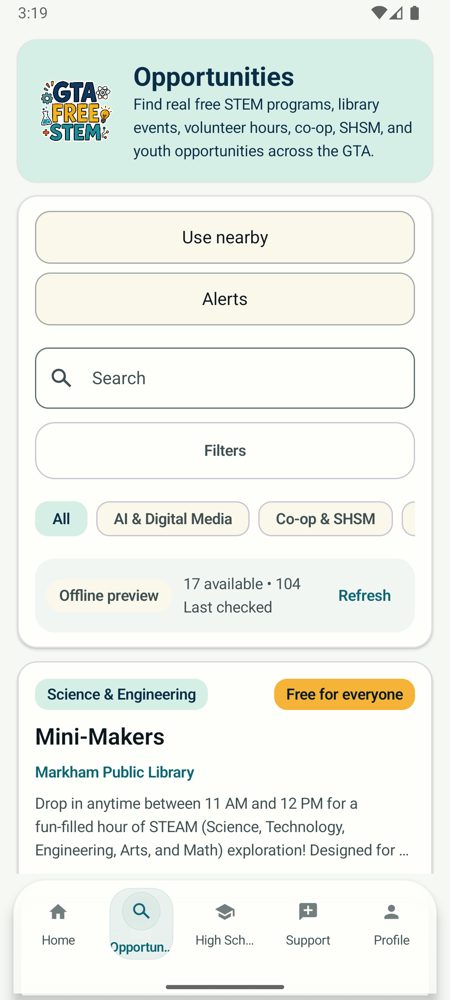
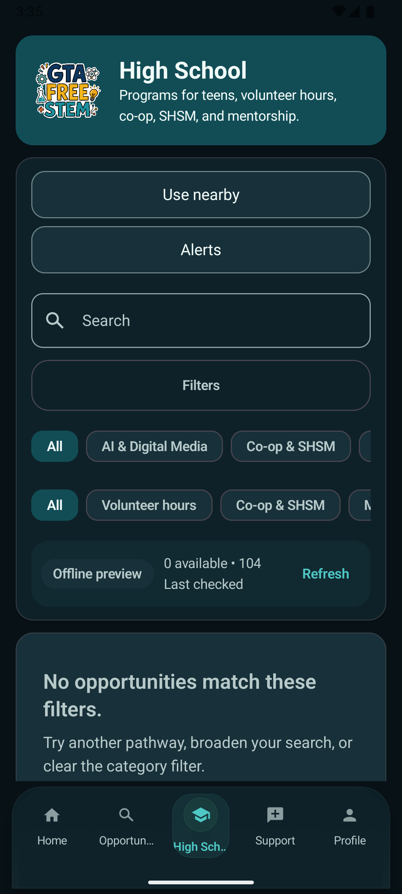
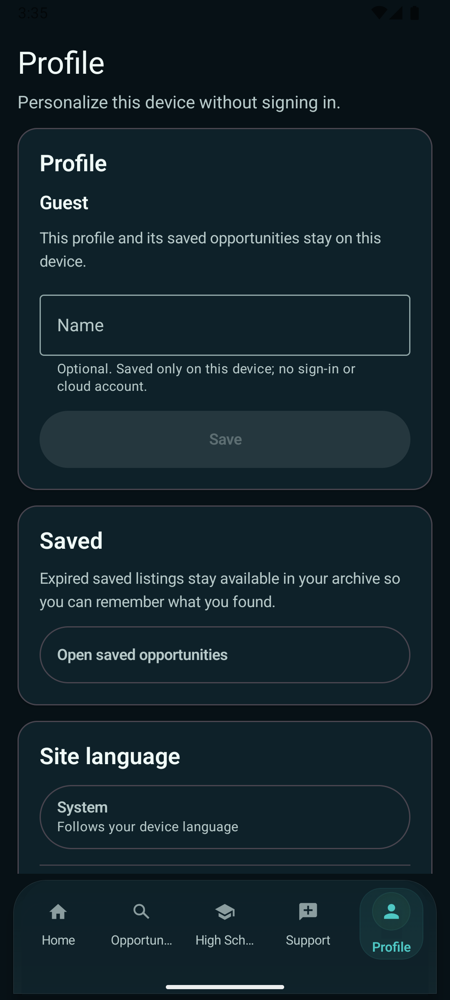

# GTA FREE STEM for Android

I'm building GTA FREE STEM to make free STEM programs easier to find across the Greater Toronto Area. This is the native Android app, built with Kotlin and Jetpack Compose.

[iOS app](https://github.com/rupayon123/gta-free-stem-ios) · [Web app](https://github.com/rupayon123/gta-free-stem-opportunities) · [Try the website](https://gta-free-stem.vercel.app/)

## The Android experience

<table>
  <tr><th width="50%">Home</th><th width="50%">Search</th></tr>
  <tr>
    <td align="center"><a href="docs/showcase/home.png"></a></td>
    <td align="center"><a href="docs/showcase/search.png"></a></td>
  </tr>
  <tr><th>High School Search</th><th>Profile</th></tr>
  <tr>
    <td align="center"><a href="docs/showcase/hs-search.png"></a></td>
    <td align="center"><a href="docs/showcase/profile.png"></a></td>
  </tr>
</table>

## About the app

Search programs by location, age, category, and language. The High School section focuses on volunteer hours, co-op, SHSM, and mentorship. Saved opportunities, profile preferences, and optional new-match alerts stay on your device.

There's no account to create, and no ads or analytics. Nearby search uses an approximate location only when you ask for it. Program links open the provider's website.

## Development status

I'm working on version 1.1.0. It isn't a public Google Play release. Version 1.0.1 was made available to internal testers only.

The current Android CI run has compilation errors that still need fixing. The screenshots show an installed development build, not a verified build of the latest source.

[Build status](https://github.com/rupayon123/gta-free-stem-android/actions) · [Release notes and checklist](docs/ANDROID_RELEASE_RUNBOOK.md) · [Previous verification records](verification/V1.1.0-LOCAL-VERIFICATION.md)

## Run locally

You'll need Android Studio, Android SDK 36, and Java 17. The app supports Android 8.0 and newer.

1. Open this repository in Android Studio.
2. Let Android Studio configure the SDK location in `local.properties`.
3. Run the `app` configuration on an emulator or Android device.

To run the unit tests, lint, and debug build:

```bash
./gradlew --no-daemon testDebugUnitTest lintDebug assembleDebug
```

Debug builds aren't Google Play upload artifacts. Signing files and passwords belong outside this repository.

## Contributing

This is my personal project, separate from my work at SARIT. Help with accessibility, translations, device testing, and bug fixes is welcome.

- [Contributing](CONTRIBUTING.md)
- [Localization](docs/LOCALIZATION.md)
- [Code of conduct](CODE_OF_CONDUCT.md)
- [Security](SECURITY.md)
- [Privacy and data safety](docs/PRIVACY_AND_DATA_SAFETY_DRAFT.md)

## License

[MIT](LICENSE) for the app's source and documentation. Program descriptions and third-party names and materials belong to their respective owners.
